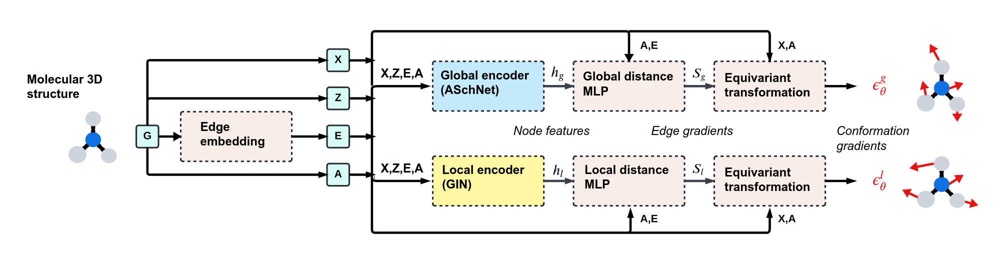

# AGDIFF: Attention-Enhanced Diffusion for Molecular Geometry Prediction

[](https://github.com/ADicksonLab/AGDIFF/blob/main/LICENSE)

**[paper](https://pubs.acs.org/doi/10.1021/acs.jcim.4c01896)**


This repository contains the official implementation of the work "AGDIFF: Attention-Enhanced Diffusion for Molecular Geometry Prediction".

AGDIFF introduces a novel approach that enhances diffusion models with attention mechanisms and an improved SchNet architecture, achieving state-of-the-art performance in predicting molecular geometries.

### Unique Features of AGDIFF

- **Attention Mechanisms**: Enhances the global and local encoders with attention mechanisms for better feature extraction and integration.
- **Improved SchNet Architecture**: Incorporates learnable activation functions, adaptive scaling modules, and dual pathway processing to increase model expressiveness.
- **Batch Normalization**: Stabilizes training and improves convergence for the local encoder.
- **Feature Expansion**: Extends the MLP Edge Encoder with feature expansion and processing, combining processed features and bond embeddings for more adaptable edge representations.

<p align="center">
	
</p>


https://github.com/user-attachments/assets/78feda75-3a20-422a-9b3f-f96fceea69cc


## Content ##
0. [Environment Setup](#environment-setup)
0. [Dataset](#dataset)
0. [Training](#training)
0. [Generation](#generation)
0. [Evaluation](#evaluation)
0. [Acknowledgment](#acknowledgement)
0. [Citation](#citation)


## Environment Setup ##


### Install dependencies via Conda/Mamba

Make sure to install the versions of the PyG dependencies specified below, as those should be compatible with the C++ API.

```bash
conda env create -f agdiff.yml
```
```bash
conda activate agdiff
```
```bash
pip install torch-geometric==2.6.1
```
```bash
pip install torch-scatter==2.1.2+pt24cu121 -f https://data.pyg.org/whl/torch-2.4.0+cu121.html
```
```bash
pip install torch-sparse==0.6.18+pt24cu121 -f https://data.pyg.org/whl/torch-2.4.0+cu121.html
```
```bash
pip install torch-cluster==1.6.3+pt24cu121 -f https://data.pyg.org/whl/torch-2.4.0+cu121.html
```

Once you installed all the dependencies, you should install the package locally in editable mode:

```bash
pip install -e .
```

### Install PyG C++ API

In order to successfully compile the c++ example you need to install the exact version of the Pytorch and PyG dependencies C++ APIs as you used for saving the scripted model in Python in yout mlforce_ft env.

1- Install libtorch:

```bash
wget https://download.pytorch.org/libtorch/cu121/libtorch-cxx11-abi-shared-with-deps-2.4.0%2Bcu121.zip
```

```bash
export CMAKE_PREFIX_PATH="<PATH_TO_LIBTORCH>"
```

2- Install PyG dependencies C++ APIs by downloading the zip file of the correct versions.

```bash
cd ~
```
```bash
mkdir packages && cd packages
```
```bash
wget https://github.com/rusty1s/pytorch_cluster/releases/tag/1.6.3.zip
```

```bash
wget https://github.com/rusty1s/pytorch_sparse/releases/tag/0.6.18.zip
```

```bash
wget https://github.com/rusty1s/pytorch_scatter/releases/tag/2.1.2.zip
```

change c++ standard 14 t o17 in cmakelist.txt.

Example of installing torch scatter C++ API based upon **[pytorch_geometric](https://github.com/pyg-team/pytorch_geometric/tree/master/examples/cpp)**

```bash
cd "<PATH_TO_PYTORCH_SCATTER>"
```

```bash
mkdir build && cd build
```
Run this to obtain -DCMAKE_PREFIX_PATH:
 
```bash
import torch; print(torch.utils.cmake_prefix_path)
``` 

```bash
cmake -DWITH_CUDA=on -DCMAKE_PREFIX_PATH="..." ..
```

```bash
make -j 8
```

```bash
make install -j 8
```

<!-- ```bash
export LD_LIBRARY_PATH=~/.local/lib:$LD_LIBRARY_PATH
```
```bash
export CMAKE_PREFIX_PATH=~/.local/share/cmake/TorchScatter:$CMAKE_PREFIX_PATH
```

```bash
export CMAKE_PREFIX_PATH=~/.local/share/cmake/TorchCluster:~/mnt/home/fathinia~/.local/share/cmake/TorchScatter:$CMAKE_PREFIX_PATH
``` -->


## Dataset ##

### Official Dataset

The preprocessed datasets (GEOM) provided by [GEODIFF](https://github.com/MinkaiXu/GeoDiff?tab=readme-ov-file#dataset) can be found in this [[Google Drive folder]](https://drive.google.com/drive/folders/18EmDt_TK157Ip5vWxUDUiKsjYN_zj51-?usp=sharing). After downloading and unzipping the dataset, it should be placed in the folder path specified by the `dataset` variable in the configuration files located at `./configs/*.yml`. You may also want to use the pretrained model provided in the same link.


The official raw GEOM dataset is also available [[here]](https://dataverse.harvard.edu/dataset.xhtml?persistentId=doi:10.7910/DVN/JNGTDF).

## Training ##

AGDIFF's training details and hyper-parameters are provided in the config files (`./configs/*.yml`). Feel free to tune these parameters as needed.

To train the model, use the following commands:

```bash
python scripts/train.py ./configs/qm9_default.yml
python scripts/train.py ./configs/drugs_default.yml
``` 
Model checkpoints, configuration YAML files, and training logs will be saved in a directory specified by `--logdir` in `train.py`.

## Generation ##

To generate conformations for entire or part of test sets, use:

```bash 
python scripts/test.py ./logs/path/to/checkpoints/${iter}.pt ./configs/qm9_default.yml \
    --start_idx 0 --end_idx 200
```
Here `start_idx` and `end_idx` indicate the range of the test set that we want to use. To reproduce the paper's results, you should use 0 and 200 for start_idx and end_idx, respectively. All hyper-parameters related to sampling can be set in `test.py` files. Specifically, for testing the qm9 model, you could add the additional arg `--w_global 0.3`, which empirically shows slightly better results.

We also provide an example of conformation generation for a specific molecule (alanine dipeptide) in the `examples` folder. To generate conformations for alanine dipeptide, use:

```bash 
python examples/test_alanine_dipeptide.py ./logs/path/to/checkpoints/${iter}.pt ./configs/qm9_default.yml ./examples/alanine_dipeptide.pdb 

```

## Evaluation ##

After generating conformations, evaluate the results of benchmark tasks using the following commands.

### Task 1. Conformation Generation

Calculate `COV` and `MAT` scores on the GEOM datasets with:

```bash
python scripts/evaluation/eval_covmat.py path/to/samples/sample_all.pkl
```


## Acknowledgement ##

Our implementation is based on [GEODIFF](https://github.com/MinkaiXu/GeoDiff), [PyTorch](https://pytorch.org/), [PyG](https://pytorch-geometric.readthedocs.io/en/latest/index.html), [SchNet](https://github.com/atomistic-machine-learning/SchNet)


## Citation ##

If you use our code or method in your work, please consider citing the following:

```bibtex
@misc{wyzykowskiAGDIFFAttentionEnhancedDiffusion2024,
  title = {{{AGDIFF}}: {{Attention-Enhanced Diffusion}} for {{Molecular Geometry Prediction}}},
  shorttitle = {{{AGDIFF}}},
  author = {Wyzykowski, Andr{\'e} Brasil Vieira and Fathi Niazi, Fatemeh and Dickson, Alex},
  year = {2024},
  month = oct,
  publisher = {ChemRxiv},
  doi = {10.26434/chemrxiv-2024-wrvr4},
  urldate = {2024-10-09},
  archiveprefix = {ChemRxiv},
  langid = {english},
  keywords = {attention,conformer,diffusion models,generative,GNN,graph neural network,machine learning,structure}
}
```

Please direct any questions to André Wyzykowski (abvwmc@gmail.com) and Alex Dickson (alexrd@msu.edu).
